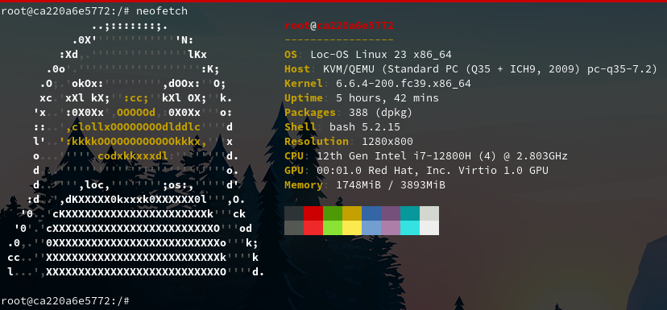

# loc-os-23-base-container-image

This repository helps to build a loc-os 23 Operating System Base Container Image Using Build.

Based on the instructions in https://gitlab.com/loc-os_linux/debian12-to-loc-os23 git repo.

